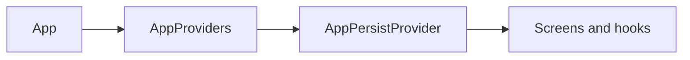

# Ultimatum Sudoku

[](https://docs.expo.dev/)
[](https://reactnative.dev/)
[](https://www.typescriptlang.org/)
[](LICENSE)

Classic **9×9 Sudoku** for **Android** and **iOS**, with progression, achievements, and theming. Built with [Expo](https://expo.dev/) and React Native. The app works **offline**; progress stays on-device (AsyncStorage). The native project name in Expo config is **Sudoku** ([`app.config.ts`](app.config.ts) `name` / `slug`).

## Features

- **Five difficulties** — Easy through **Ultimatum** (tuned clue removal for each tier).
- **Notes**, **undo**, and up to **three hints** per puzzle.
- **XP** and **levels** with a **rank** ladder (Novice → Ultimatum).
- **Achievements** — e.g. first solve, flawless run, no hints, speed on Easy, Expert / Ultimatum clears, streaks, perfect Expert.
- **Streaks**, **best times** per difficulty, **solve history**, and **resume** for in-progress games.
- **Light / dark** mode and **accent** color themes.
- **Settings** — highlight matching digits, show conflicts, auto-remove pencil marks, timer visibility.
- **Pause** overlay, **haptic** feedback, and an error boundary for resilience.

## Screenshots

**Coming soon.** Add 2–4 captures under `.github/` or `docs/`, then link them here (for example ``). Until then, run the app locally (see below) to preview the UI.

## Getting started

**Prerequisites:** Node.js (LTS recommended), npm, and the [Expo dev environment](https://docs.expo.dev/get-started/set-up-your-environment/) (Android Studio / Xcode for emulators or physical devices).

```bash
npm install
npm start
```

Then open the dev client: press `a` (Android), `i` (iOS), or scan the QR code with [Expo Go](https://expo.dev/go).

```bash
npm run android
npm run ios
npm run web
```

**Quality checks:**

```bash
npm run lint
npm run typecheck
npm test
```

**Formatting (optional):**

```bash
npm run format
npm run format:check
```

Before a release, run `npx expo-doctor` and fix any reported issues.

## Project layout

- [`app.config.ts`](app.config.ts) — Expo app configuration (icons, splash, platforms).
- [`src/App.tsx`](src/App.tsx) — Root component.
- [`src/screens/`](src/screens/) — Home, game, win flows.
- [`src/components/`](src/components/) — Grid, modals, toasts, error boundary.
- [`src/game/`](src/game/) — Engine, types, constants, achievements.
- [`src/hooks/useGameSession.ts`](src/hooks/useGameSession.ts) — Active puzzle state and actions.
- [`src/persistence/`](src/persistence/) — AsyncStorage schema and load/save.
- [`src/context/AppPersistProvider.tsx`](src/context/AppPersistProvider.tsx) — Global persisted settings and progression.
- [`src/theme/tokens.ts`](src/theme/tokens.ts) — Theme and accent tokens.
- [`assets/`](assets/) — Icons and splash assets.
- [`legacy/`](legacy/) — Original single-file prototype (see below).

## Architecture



`AppProviders` wraps the tree with an error boundary, safe areas, and persistence. Gameplay logic runs through `useGameSession`; long-term data goes through `src/persistence/`.

## Building for the stores

Production binaries usually use [EAS Build](https://docs.expo.dev/build/introduction/). Configure bundle identifiers / package names, signing, and `eas.json` per Expo’s [Android](https://docs.expo.dev/submit/android/) and [iOS](https://docs.expo.dev/submit/ios/) submit guides — those steps change often, so this repo links to the docs instead of duplicating them.

For Android Play releases, set your own `android.package` in `app.config.ts`, bump `version` (and Android version code as needed), then run EAS production builds and submit the generated artifact.

## Privacy

The app does not send game data to remote servers. Settings and progress remain on the device.

## Contributing

Issues and pull requests are welcome. Before opening a PR, run `npm run lint` and `npm test`, and keep changes focused on the problem you are solving.

## Legacy prototype

[`legacy/UltimatumSudoku.jsx`](legacy/UltimatumSudoku.jsx) is the earlier **all-in-one** React prototype. The shipping mobile app is the TypeScript/Expo project under `src/`; it preserves the same design goals (difficulties, XP, ranks, achievements, themes) in a modular layout.

## License

Licensed under the [MIT License](LICENSE).
