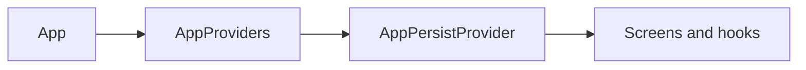

# Ultimatum Sudoku

[](https://github.com/AmanVatsSharma/Sudoku/actions/workflows/ci.yml)
[](https://docs.expo.dev/)
[](https://reactnative.dev/)
[](https://www.typescriptlang.org/)
[](LICENSE)

**Ultimatum Sudoku** is a feature-complete, offline-first **9×9 Sudoku** game for **Android** and **iOS**, built with [Expo](https://expo.dev/) and React Native. Progress, settings, and achievements stay on the device ([AsyncStorage](https://github.com/react-native-async-storage/async-storage)); no game data is sent to external servers.

Display name **Sudoku Ultimatum**, Expo slug `sudoku-ultimatum`, Android package `dev.sudoku.ultimatum` — see [`app.config.ts`](app.config.ts).

---

## Download (Android)

| Artifact                                                                                         | Description                                                                                                                                          |
| ------------------------------------------------------------------------------------------------ | ---------------------------------------------------------------------------------------------------------------------------------------------------- |
| [**Sudoku-Ultimatum-1.0.2-multiabi.apk**](releases/Sudoku-Ultimatum-1.0.2-multiabi.apk) (~58 MB) | **v1.0.2** — universal release APK with **armeabi-v7a**, **arm64-v8a**, **x86**, and **x86_64** native libs (phones, tablets, and common emulators). |

**Install:** transfer the APK to your device, enable installing from your file manager or browser if Android asks, then open the file to install.

**Signing:** this build uses the default template keystore suitable for **trying the app** and sideloading. For **Google Play**, build and sign with your own upload key or use [EAS Submit](https://docs.expo.dev/submit/introduction/).

**Faster local builds:** you can pass `-PreactNativeArchitectures=arm64-v8a` to Gradle for a smaller single-ABI APK during development (not recommended for sharing widely).

---

## Features

- **Five difficulties** — Easy through **Ultimatum** (tuned clue removal per tier).
- **Notes**, **undo**, and up to **three hints** per puzzle.
- **XP**, **levels**, and **ranks** (Novice → Ultimatum).
- **Achievements** — first solve, flawless run, no hints, speed on Easy, Expert / Ultimatum clears, streaks, perfect Expert.
- **Streaks**, **best times**, **solve history**, and **resume** for in-progress games.
- **Light / dark** themes and **accent** colors.
- **Settings** — matching highlights, conflict display, auto-clear pencil marks, timer visibility.
- **Pause**, **haptics**, and an **error boundary** for stability.

---

## Tech stack

- **Expo SDK 53**, **React Native 0.79**, **TypeScript**
- **State & persistence:** React hooks, AsyncStorage, validated schemas under [`src/persistence/`](src/persistence/)
- **CI:** GitHub Actions — lint, Prettier, `tsc`, Jest ([`.github/workflows/ci.yml`](.github/workflows/ci.yml))

---

## Development

**Prerequisites:** Node.js (LTS recommended), npm, and the [Expo environment](https://docs.expo.dev/get-started/set-up-your-environment/) if you use simulators or devices.

```bash
npm install
npm start
```

Then press `a` (Android), `i` (iOS), or use [Expo Go](https://expo.dev/go). Optional:

```bash
npm run android
npm run ios
npm run web
```

**Quality checks:**

```bash
npm run lint
npm run typecheck
npm run format:check
CI=true npm test
```

Before a release, run `npx expo-doctor` and fix any reported issues.

---

## Project layout

| Path                                                         | Role                                                                                                                                  |
| ------------------------------------------------------------ | ------------------------------------------------------------------------------------------------------------------------------------- |
| [`app.config.ts`](app.config.ts)                             | Expo config (name, icons, Android package, etc.)                                                                                      |
| [`src/App.tsx`](src/App.tsx)                                 | App root                                                                                                                              |
| [`src/SudokuApp.tsx`](src/SudokuApp.tsx)                     | Navigation / screen flow                                                                                                              |
| [`src/screens/`](src/screens/)                               | Home, game, win                                                                                                                       |
| [`src/components/`](src/components/)                         | Grid, modals, toasts, error boundary                                                                                                  |
| [`src/game/`](src/game/)                                     | Engine, types, achievements                                                                                                           |
| [`src/hooks/useGameSession.ts`](src/hooks/useGameSession.ts) | Active game session                                                                                                                   |
| [`src/persistence/`](src/persistence/)                       | Storage schema and migrations                                                                                                         |
| [`assets/`](assets/)                                         | Icons, splash, adaptive layers; regenerate via [`scripts/build-assets.py`](scripts/build-assets.py) + `assets/icon-source-master.png` |
| [`legacy/UltimatumSudoku.jsx`](legacy/UltimatumSudoku.jsx)   | Original one-file web prototype (reference)                                                                                           |

---

## Architecture



Gameplay runs through **`useGameSession`**; long-term data flows through **`src/persistence/`** with validation. The **puzzle generator** ensures a **unique solution** (unlike the legacy prototype’s simple cell removal). Details are in [`src/game/engine.ts`](src/game/engine.ts).

---

## Building

### EAS (cloud)

Production workflows typically use [EAS Build](https://docs.expo.dev/build/introduction/). For an **APK** for testing or sideloading, after `eas login`:

```bash
eas build --profile preview --platform android
```

The [`preview`](eas.json) profile is set to `android.buildType: "apk"`. **Production** on Play uses an **AAB** (`production` profile). See Expo’s [Android submit](https://docs.expo.dev/submit/android/) guide for store setup.

### Local Android APK (Gradle)

If you have **Android SDK** and **JDK 17**, you can run **`npx expo prebuild --platform android`**, point **`android/local.properties`** at your SDK (`sdk.dir=...`), install the API / NDK versions Gradle prints, then:

```bash
export JAVA_HOME=/path/to/jdk-17
cd android
./gradlew assembleRelease -PreactNativeArchitectures=arm64-v8a
```

Output: `android/app/build/outputs/apk/release/app-release.apk`. Use your own keystore for Play.

---

## Privacy

No remote servers are used for gameplay data. Settings and progress remain on the device.

---

## Contributing

Contributions are welcome. Please read [**CONTRIBUTING.md**](CONTRIBUTING.md) for guidelines, the PR checklist (lint, typecheck, tests), and how to report issues.

- **Issues:** [github.com/AmanVatsSharma/Sudoku/issues](https://github.com/AmanVatsSharma/Sudoku/issues)
- **Discussions:** use Issues for now unless the repository enables GitHub Discussions.

Whether you fix a bug, add a test, improve accessibility, or clarify documentation, your help is appreciated.

---

## Legacy prototype

[`legacy/UltimatumSudoku.jsx`](legacy/UltimatumSudoku.jsx) is the earlier all-in-one React prototype. The shipping app under **`src/`** keeps the same design goals in a modular, typed codebase.

---

MIT License — see [LICENSE](LICENSE).
